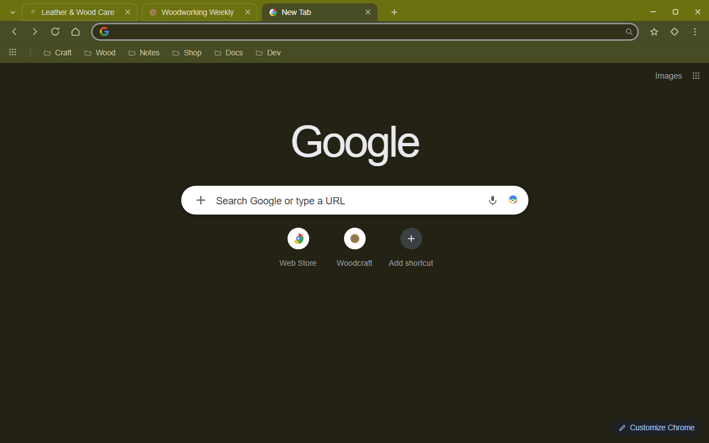
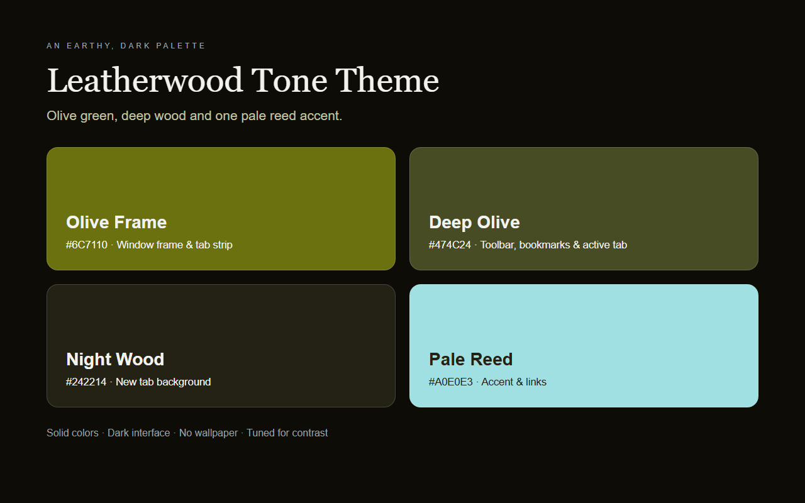
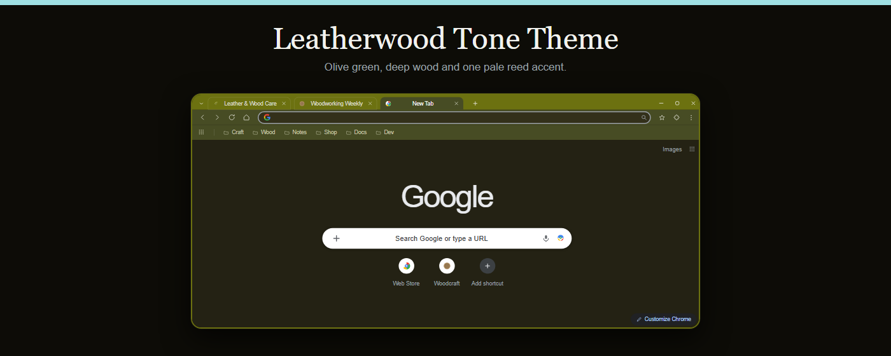
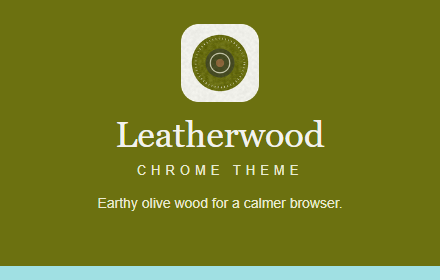

<div align="center">
  

# Leatherwood Tone Theme

**皮革木调 · 一款沉静的暗色 Chrome 主题**

An earthy dark Chrome theme in olive green and night-wood brown. Solid colors, light text tuned for contrast, and one pale reed accent for links — no wallpaper, no gradient, no textures.


</div>

> 橄榄绿窗框、深橄榄工具栏、夜木色新标签页，配一抹浅苇色强调。所有表面都是纯色，没有任何壁纸或纹理图片。

---

## ✨ Features | 特性

| | |
| --- | --- |
| Solid-color theme | No wallpaper, no gradient, no image assets to load |
| Olive-green frame | Window control buttons share the frame tone instead of a separate block |
| Deep olive toolbar | Toolbar, bookmark bar and active tab step down one shade for depth |
| Night-wood new tab | A dark brown new-tab page that keeps the browser quiet at night |
| Tuned legibility | Light text and icons (`#F0F0EA` / `#E1E1D5`) stay readable on every olive layer |
| Single-color Google logo | `ntp_logo_alternate` keeps the new-tab mark in one neutral tone |
| No scripts, no permissions | A theme only — it never reads or changes the pages you visit |

---

## 🎨 Color Palette | 配色

| Role | Color | Hex (RGB) |
| --- | --- | --- |
| Window frame / tab strip | Olive Frame | `#6C7110` (108, 113, 16) |
| Toolbar / bookmarks / active tab | Deep Olive | `#474C24` (71, 76, 36) |
| New tab background | Night Wood | `#242214` (36, 34, 20) |
| Address bar | Deep Shadow | `#33301A` (51, 48, 26) |
| Text & icons | Warm Chalk | `#F0F0EA` (240, 240, 234) |
| Accent & links | Pale Reed | `#A0E0E3` (160, 224, 227) |
| Toolbar button accent | Olive Sprout | `#9FA540` (159, 165, 64) |

The olive layers are deliberately close in hue and far apart in depth: the frame carries the brand green, the toolbar and bookmark bar sit a shade darker so content stays anchored, and the new-tab page drops to night-wood brown so late-night browsing is easy on the eyes. Pale reed is used only for links and highlights, never for body text.

---

## 🖼️ Preview | 预览

Store screenshots and promo tiles are illustrative HTML/CSS layouts rendered by headless Chromium, not native Chrome captures. Theme surfaces are read from `manifest.json`; Chrome-owned tones are documented in [`store-assets/ASSET-NOTES.md`](store-assets/ASSET-NOTES.md).

### Store Screenshots | 商店截图 1280×800

**Browser interface** — the themed window with the new tab page.



**Palette & highlights** — the four colours and what they control.



### Promo Tiles | 宣传图

**Marquee tile — 1400×560**



**Small tile — 440×280**



---

## 🚀 Install | 安装

### From source (unpacked)

1. Open `chrome://extensions` in Chrome.
2. Enable **Developer mode** (top-right toggle).
3. Click **Load unpacked** and select this project folder.

Reload the page afterwards to confirm the frame, toolbar and new tab page pick up the olive palette.

### From Chrome Web Store

> Coming soon — the install link will be added here once the theme is published.

---

## 📂 Project Structure | 项目结构

```
leatherwood-tone-theme/
├── manifest.json          # Theme configuration (Manifest V3, no scripts)
├── logo/logo.png          # The single 128px theme icon
├── scripts/               # Asset generation & packaging
│   ├── generate-logo.py           # logo (128px)
│   ├── generate-logo-candidates.py# logo candidate sheet
│   ├── generate-store-assets.py   # entry point for screenshots + promo
│   ├── generate-references.py     # the headless-Chromium composer
│   ├── package.py                 # ZIP for the Chrome Web Store
│   └── requirements.txt
├── store-assets/
│   ├── screenshots/en/    # 2 x 1280x800 store screenshots
│   ├── promo/             # 440x280 + 1400x560 promo tiles
│   ├── icon-candidates/   # logo concepts that were considered
│   ├── store-description.txt
│   └── ASSET-NOTES.md
├── README.md
└── LICENSE
```

---

## 🛠️ Regenerate Assets | 重建素材

```bash
pip install -r scripts/requirements.txt
playwright install chromium

python3 scripts/generate-logo.py             # the 128px logo
python3 scripts/generate-store-assets.py     # screenshots + promo tiles
```

All four store assets come from one composer script — change the styling there and re-run, instead of editing a PNG.

---

## 📦 Package | 打包

```bash
python3 scripts/package.py
```

The script writes a single ZIP with `manifest.json` at the root, containing only the theme itself (`manifest.json`, `logo/`, `README.md`, `LICENSE`) and skipping screenshots, promo tiles and scripts, which are uploaded through separate fields in the Chrome Web Store dashboard.

Default output: `leatherwood-tone-theme-1.0.0.zip` in the folder that holds the theme projects.

---

## 📄 License | 许可

**Non-Commercial License** — see [`LICENSE`](LICENSE).

- ✅ Personal use, modification, and redistribution.
- ❌ Commercial use of any kind (bundling, resale, paid services).
- 💬 Commercial licensing: contact the author.

---

<div align="center"><sub>Made with olive green and a lot of patience.</sub></div>
